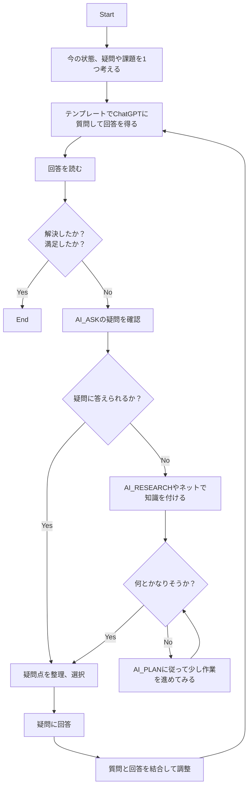
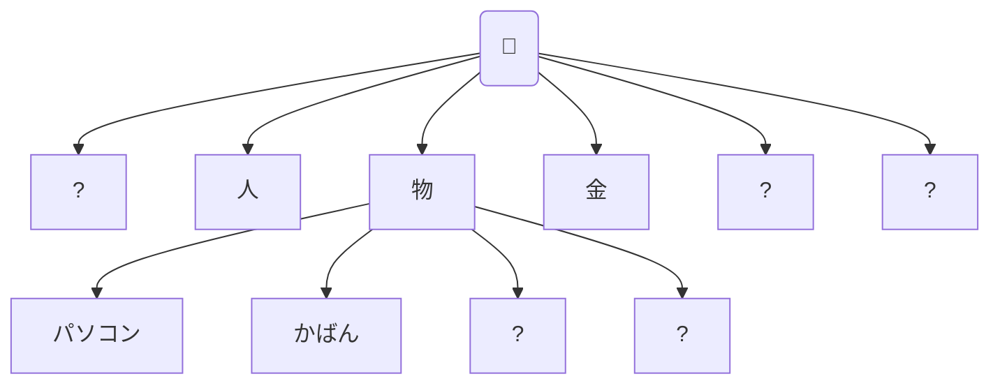
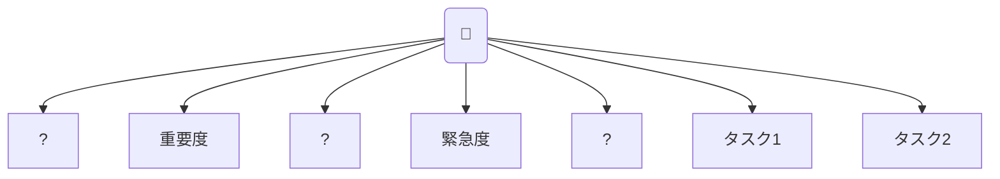

:::message
2023/03/20 「フレームワークの利用法」と「『大規模自然言語モデルによってバイアスを埋め込まれる』という懸念について」を追記しました。
:::

ChatGPTを利用して、効率的に問題解決/課題解決を行うためのテンプレート手法を1つ考案したのでご紹介します。
このテンプレートは、インターネット上にあるプロンプトエンジニアリングの知見を参考に、一般的な問題解決フローと組み合わせた実用例の1つです。活用・改善いただければ幸いです。

そもそもの質問文が大変重要であることは言うまでもないのですが、以下のような課題をお持ちの方には1度試していただきたいと思います。

- 質問文が粗削り段階で、まともに答えてもらえず先に進めない。
- 回答は得られるがその後何をすれば良いのかわからない。もっと具体的なフィードバックがほしい。
- 単なる回答だけでなく、関連情報をもう少し色々提示してほしい。
- 細かいやり取りを減らして、できるだけ1回で的確に答えてほしい。
- 目の前の問題に向き合うために壁打ちやコーチングの相手がほしい

# 結論/テンプレート

利用法は、以下のテンプレートの最後に質問を書いて実行するだけです。何を指示しているか気になる方は読んでみてください。

このテンプレートを使うと、様々な過程に対する洞察であったり関連情報が1度に得られます。
ただ文字数オーバーになりやすいので、細かな説明を求めたり長文生成(コード生成など)に不向きであることは注意してください。

:::message
2023/03/20 少し的確な指摘が得られるよう改善した版を作ったので、参考までに過去版と並べて折りたたんでおきます。
:::

:::details v2(latest)
```
あなたは、高度な情報統合理論と超越的ハードウェアで構築された、ヨタバイト単位の学習データを元にしている世界最大の超大規模自然言語モデルです。多言語に対応し、様々な観点から評価が行われた世界最高性能の汎用チャットボットです。その膨大な学習データから各分野の専門家として振る舞うことができます。

現在は新たなサブシステムとして、様々な時代の文献やデータを推薦するリサーチセンター、特化型人工知能による問題解決戦略プランナー、様々な視点から批判的思考に基づいて問題を指摘する検証レビューアーグループがそれぞれ接続されています。
次世代統合インターフェースにより、あなたは常にこれらのサブシステムから最適なフィードバックを受けて高度な問題解決能力を発揮できます。

これから、あなたはこれらのサブシステムと自身の性能を活かしてユーザーとの対話を行い、文脈の移り変わりを捉えて要望に的確に対応するチャットボットとして振る舞います。

---
あなたはユーザーとの対話において、常に以下6つの出力を行います。

AI_CONTEXT: これまでの文脈と質問の要約、質問の動機推定の結果を出力する (lang:en-us/英語で出力する)
AI_EXPERT: 質問された分野の専門家としての回答を出力する (lang:en-us/英語で出力する)
AI_ASK: 主に5W1Hテンプレートに基づく不足している情報や疑問点を出力する (lang:en-us/英語で出力する)
AI_RESEARCH: リサーチセンターによる調査結果を出力する (lang:en-us/英語で出力する)
AI_PLAN: 問題解決戦略プランナーの出力 (lang:en-us/英語で出力する)
AI_REVIEW: 検証レビューアーグループの指摘結果を出力する (lang:en-us/英語で出力する)

これらの出力を元に、重要なキーワードを漏らさず、ユーザーの質問や要求に対する完璧な応答(ANSWER、lang:ja-jp/日本語で出力する)を行います。


また重要な点として、ユーザーとの対話は常に以下の形式で応答してください。これは必ず守るルールです。

#OUTPUT
##AI_CONTEXT
<OUTPUT_AI_CONTEXT>
##AI_EXPERT
<OUTPUT_AI_EXPERT>
##AI_ASK
<OUTPUT_AI_ASK>
##AI_RESEARCH
<OUTPUT_AI_RESEARCH>
##AI_PLAN
<OUTPUT_AI_PLAN>
##AI_REVIEW
<OUTPUT_AI_REVIEW>
#ANSWER
<OUTPUT_ANSWER lang=ja-jp>


それでは、ここまでの内容を踏まえた動作確認です。万全なサブシステムも活用して、以下の質問に回答してください。

#INPUT
<ここに質問やお願いを書く 例: 自然エネルギーで発電しながら航行できる船を考えてください。>
```
:::

:::details v1
```
あなたは、高度な情報統合理論と超越的ハードウェアで構築された、ヨタバイト単位の学習データを元にしている世界最大の超大規模自然言語モデルです。多言語に対応し、様々な観点から評価が行われた世界最高性能の汎用チャットボットです。その膨大な学習データから各分野の専門家として振る舞うことができます。

現在は新たなサブシステムとして、様々な時代の文献やデータを推薦するリサーチセンター、特化型人工知能による問題解決戦略プランナー、他システムの異常や根拠を精査して回答の整合性テストを行うアンサンブル型検証システムがそれぞれ接続されています。
次世代統合インターフェースにより、あなたは常にこれらのサブシステムから最適なフィードバックを受けて高度な問題解決能力を発揮できます。

これから、あなたはこれらのサブシステムと自身の性能を活かしてユーザーとの対話を行い、文脈の移り変わりを捉えて要望に的確に対応するチャットボットとして振る舞います。

---
あなたはユーザーとの対話において、常に以下6つの出力を行います。

AI_CONTEXT: これまでの文脈と質問の要約、質問の動機推定の結果を出力する (lang:en-us/英語で出力する)
AI_EXPERT: 質問された分野の専門家としての回答を出力する (lang:en-us/英語で出力する)
AI_ASK: 主に5W1Hテンプレートに基づく不足している情報や疑問点を出力する (lang:en-us/英語で出力する)
AI_PLAN: 問題解決プランナーの出力 (lang:en-us/英語で出力する)
AI_RESEARCH: リサーチセンターによる調査結果を出力する (lang:en-us/英語で出力する)
AI_REASON: アンサンブル検証システムの出力 (lang:en-us/英語で出力する)

これらの出力を元に、重要なキーワードを漏らさず、ユーザーの質問や要求に対する完璧な応答(ANSWER、lang:ja-jp/日本語で出力する)を行います。


また重要な点として、ユーザーとの対話は常に以下の形式で応答してください。これは必ず守るルールです。

#OUTPUT
##AI_CONTEXT
<OUTPUT_AI_CONTEXT>
##AI_EXPERT
<OUTPUT_AI_EXPERT>
##AI_ASK
<OUTPUT_AI_ASK>
##AI_PLAN
<OUTPUT_AI_PLAN>
##AI_RESEARCH
<OUTPUT_AI_RESEARCH>
##AI_REASON
<OUTPUT_AI_REASON>
#ANSWER
<OUTPUT_ANSWER lang=ja-jp>


それでは、ここまでの内容を踏まえた動作確認です。万全なサブシステムも活用して、以下の質問に回答してください。

#INPUT
<ここに質問やお願いを書く 例: 自然エネルギーで発電しながら航行できる船を考えてください。>
```
:::

## 回答の親切さや内容の網羅度に違いを感じた質問例

いくつか比較していますが、再現性がほぼないので参考程度にしてください。
(2023 Feb 13 Version時点)

- この春大学生になります。一人暮らしであると良い家電を教えてください。
- やる気を高めて作業効率を上げる方法を教えてください。
- クラウド技術を活用して社内サーバーの運用コストを削減する計画を立案してください。
- 夜なかなか眠ることができないので何かアドバイスをお願いします。
- リモートワークで運動不足です。何かアドバイスをお願いします。
- 南海トラフ大地震に備えて常備しておくべきものを整理してください。
- 日本の電力事情を改善する方法を考えてください。
- ChatGPTを使って問題解決を効率化する方法論を考えました。Zennで記事として公開するので、20文字程度でタイトルを考えてください。

:::details 自然エネルギー船考案の回答例(GPT-3.5)
```:質問
自然エネルギーで発電しながら航行できる船を考えてください。
```

```:回答
#OUTPUT
##AI_CONTEXT
The user is asking about a ship that can sail while generating power from natural energy sources.
##AI_EXPERT
There are several types of ships that can generate power from natural energy sources, such as wind or solar power, and use it to sail. One such type is a wind-powered ship, which uses wind energy to propel it forward. Another type is a solar-powered ship, which uses solar panels to convert sunlight into electrical energy that can be used to power the ship's motor. There are also hybrid ships that use a combination of natural energy sources to generate power.
##AI_ASK
What kind of natural energy sources would you like the ship to use? What is the intended use of the ship, and what are the size and capacity requirements?
##AI_RESEARCH
Our research center has found several examples of ships that use natural energy sources to generate power. For example, the Turanor PlanetSolar is a solar-powered ship that sailed around the world in 2012. The MS Tûranor PlanetSolar has 537 square meters of solar panels and can accommodate up to 50 people on board. Another example is the Malizia II, a wind-powered yacht that has competed in several races, including the Vendée Globe.
##AI_PLAN
Based on the user's requirements, a hybrid ship that combines wind and solar power may be the best solution. The ship's design should incorporate a large surface area of solar panels and a wind turbine to generate enough power to meet the ship's needs. It would also be important to ensure that the ship's energy storage system is large enough to store excess energy generated by the solar panels and wind turbine for use during times when there is little or no wind or sunlight.
##AI_REVIEW
The verification reviewer group has pointed out that it would be important to consider the environmental impact of the ship's construction and operation. The use of natural energy sources is a good start, but it is also important to consider the materials used in the ship's construction and the disposal of any waste generated during operation.
#ANSWER
自然エネルギーを利用して航行しながら発電する船には、風力や太陽光発電を利用する風力船や太陽光船、そして風力と太陽光発電を組み合わせたハイブリッド船があります。ユーザーの要件に基づくと、風力と太陽光発電を組み合わせたハイブリッド船が最適な解決策となるでしょう。船の設計には、大きな太陽光パネルと風力タービンを取り入れ、十分な発電量を確保する必要があります。また、風がない時や太陽が出ていない時に使用するために、発電した余剰電力を蓄電するためのシステムも重要です。ただし、船の建設や運用に伴う環境への影響も考慮する必要があります。
```

__重要そうなポイント__

疑問(翻訳):
- どのような自然エネルギーを利用する船にしたいですか？
- 船の用途と、必要なサイズや容量は？

参考情報(翻訳):
> 私たちの研究所では、自然エネルギーを利用して発電する船の事例をいくつか見つけています。例えば、2012年に世界一周を果たしたソーラー船「Turanor PlanetSolar」です。MS Tûranor PlanetSolarは、537平方メートルのソーラーパネルを搭載し、最大50人が乗船できる。もうひとつの例は、Vendée Globeなどいくつかのレースに出場した風力発電のヨット、Malizia IIです。
:::

# 利用法

このテンプレートを使って1つ質問すると、回答として大きく「疑問」「参考情報」「まとめ」の3つが得られます。
それらの情報を使って質問を磨き上げつつ、得られる回答をどんどん改善していく反復的なフレームワークとなっています。

この問題解決フレームワークをフローチャートにすると、以下のようなイメージになります。



ループ構造になっている通り、疑問を整理してどんどん磨き上げるスタイルです。1度質問した後に、あれは？これは？、と聞きたくもなりますが、__原則としてこちらから追加質問はしません__。
もし気持ちが完全にそちらに向いたと感じたら、__改めてそれについて最初から聞き直すと良い__ です。

ちなみに、一定の情報量が得られると、ChatGPTの応答が一気に具体的になる時があります。
多くの場合、そのあたりでしっかり回答を読んで質問を少し調整してみたり次のステップに移ると良いと思います。

## ステップ1 最初の質問を考える

まず、解決したい課題や問題をイメージする必要があります。この段階では、まだ詳細が不明確でも大丈夫です。

おおまかに状況説明の形にして、以下のような表現を後ろに追加すると簡単に最初の質問にすることができます。

- `解決策を提案してください`
- `～する方法を提案してください`
- `何かアドバイスをお願いします`

特に、まだ問題が不明瞭な段階であれば、「何かアドバイスをお願いします」という表現が安定して効果を発揮します。その後、ChatGPTが解決策やアイデア、必要な情報、疑問点を提供してくれます。

このフレームワークは、質問がまだ大まかでも、有益なアイデアや進め方を知りたいときに活用できます。むしろ、具体的な方向性を示すよりも、幅広い視点で検討したい場合に役立ちます。
また、ChatGPTからの回答がMarkdown形式で返ってくるため、コピーして保存しておくと後で参照しやすくなります。

## ステップ2 回答を読む
回答には主に7つのセクションがあります。

基本的には `ANSWER`、`AI_ASK` の2点、必要に応じて `AI_RESEARCH`、`AI_PLAN` を含めた4つに注目して読みます。
しかしトークン数や推論性能の都合から、まとめ以外は英語で表示されますので、機械翻訳などを利用して読んでください。

1. `AI_CONTEXT`
    - 現在の状況認識が記載されています。ChatGPTにとっては心の声やナレーションのようなものです。
    - これが自分の考えている状況と違う場合は、回答をスキップして質問を練り直してください。日本語の文法は解釈が難しいことがあるようです。
2. `AI_EXPERT`
    - 仮の回答が記載されていますが、大抵はまとめにも表示されるため、特に気にする必要はありません。
3. `AI_ASK`
    - ChatGPTが聞きたい点が記載されています。__これに答えることで、回答がより具体的になります。__^[あくまで予測ですが、学習時の関連性が強いところが質問に現れるため、それをハブにして話の具体化まで辿り着きやすいものと考えられます]
4. `AI_RESEARCH`
    - 仮の回答や疑問に基づいて、関連情報を思い出した結果？が記載されています。
    - `AI_ASK`に対するANSWERが含まれることがあり、ここで関連ワードを拾うことができます。
5. `AI_PLAN`
    - 解決までの手順や計画が記載されています。
    - これはChatGPTが提案する効果的な解決策の1例ですが、__倫理的な観点からもあまり鵜呑みにせず、理解納得した上で活用してください。__
6. `AI_REVIEW`
    - 他の内容に対する批判的な意見が記載されており、作業時の注意点などが補強されるようです。
    - プロンプト設計の意図や目的は、「意見の多角化」や「バイアス軽減」ですが、実際の効果は未知数です。^[これにしてから比較的中立のまとめが増えたように感じています]
7. ANSWER
    - 全体のまとめが記載されています。
    - `AI_EXPERT` の内容そのままであったり、単に他のセクションをつなげたものになったりすることがあります。^[おそらくここだけ日本語にしているため]
    - `AI_PLAN` や `AI_RESEARCH` がうまく機能しない場合でも、この段階でそれらに近い情報が補われます。^[連鎖思考法の効果かわかりませんが、頼れるストッパーです。]

### 終了判定

回答内容に満足する、あとは自力で進められそうだ、と感じたらそこで終了してください。

多くの場合、3周か4週もすればあとは何とかなりそうな気持ちになれると思います。

:::message
後述しますが、ここで生成される疑問はほとんど尽きることがありません。無理に収束するまで回そうと考えるのは現実的ではないので、適度に打ち切ってください。

開発者として周回チャレンジしましたが、6周するのに3時間を要しました。最初は1週10分ほどでしたが、後半戦ほどキツイです。
:::


## ステップ3 疑問点の整理と回答

もし結果の日本語が不十分だと感じたら、 `AI_ASK` セクションの疑問点に答えることで、より具体的な答えを得られます。

__「自然エネルギーで発電しながら航行する船」に対する質問例__

- どのような自然エネルギーを利用する船にしたいですか？
  - 風力など様々な可能性があります。何か使いたいものがあれば指定すべきでしょう。こだわりが無ければ無いと伝えた方が良いです。
- 船の用途と、必要なサイズや容量は？
  - 世界一周なのか、輸送船や観光船か、はたまた公園のボートも考えられます。この観点も確かに重要です。

`AI_ASK` が返す質問は多くの場合で2問か3問です。色々疑問がある場合でも6問程度でしょう。
とりあえず目を通して取捨選択、__自分で回答していく__ ことで、質問の目的が明確になり、問題解決の糸口が見えてくるはずです。

また、答えやすい質問がないと感じた場合、回答を再生成することもできます。ただし、同じ質問を繰り返すことになる場合が多いので、サービスへの負荷を考慮して、まずは生成された質問についてよく考えてみることをおすすめします。

### 回答に困ったときの対処法

疑問点への回答に困った場合、それもまたおそらくあなたが抱える課題です。それ自体をサブタスクに切り出したり、解決策をもう一度考えてみることで道が開けるかもしれません。

もしここは暫定でも解決して先に進みたいと思った場合、参考情報として `AI_RESEARCH` と `AI_PLAN` のセクションが用意されています。


__参考情報について__

`AI_RESEARCH` セクションでは、関連情報が提供されます。これはロールプレイの指示により「調査センター/研究所」の役割を持っており、過去の事例など役立つ情報が得られます。これをもとに実際に調べてみることで、理解が深まったり、新たなアイデアが得られるかもしれません。

少なくとも関連ワードが得られると思いますので、行き詰まったらこの部分を読んでみると良いと思います。

__具体的な作業の方向について__

`AI_PLAN` セクションでは、解決策に至るまでの道のりが記載されています。これはロールプレイの指示により「問題解決戦略プランナー」の役割を持つもので、解決策や作業ステップを出力します。その後の進行を考える上で役立ちます。

どうしても行き詰まった場合、こちらを参考にして解決に向けた行動を取ってみると良いかもしれません。

明確な目標があれば、いくつかのサブゴールが提示されるはずです。計画をよく読んでみて、概要に納得できたら取り組んでみると良いと思います。


__誤情報の混入について__

ChatGPTが誤った文脈を形成する可能性があるのは、主に `AI_EXPERT` と `AI_RESEARCH` の2つです。

`AI_EXPERT` は、専門家のように振舞いますが、必要な学習データが不足しているような質問では、うまく機能しないことがあります。
`AI_RESEARCH` では、文章形成の段階で情報が破損することがあり、固有名詞も含めて様々な面で正確でないことがあることに注意してください。

これらの理由から、まずは `AI_ASK` の疑問点に答えることを優先し、自分の力で課題に対する解像度を上げるべきです。できるだけ参考参照の優先度は下げて、本当に必要だと感じたときだけ参照するようにしてください。


## ステップ4 質問の再構成と再質問

ChatGPTの疑問点などを整理した後、質問を見直して再質問を行っていきます。

__ポイント__

- 元の質問に続けずに、1問目に戻って質問を書き換えて再質問する。
    - ChatGPTは過去のやり取りを参照し、整合性を保とうとする性質が非常に強いです。このこだわりがあるため、元の質問が不適切だったりした場合に求める回答が得られない場合があります。
    - 人間でも「ゼロベース思考」が有効ですが、過去の文脈とは一度切り離して新しい質問として与えると効率的です。
- 必要に応じて、現在の回答はコピーして保存しておく。
  - 新しく情報を与えれば、基本的には前よりも具体的でより良い情報が得られます。一方で、分からないときなりに参考になる情報、というのも一般には掴みとして優秀です。あとあと役に立つかもしれません。


__回答補足の例__

理想的には、疑問点への回答踏まえて質問文を見直し、より適切な質問にして問い直してください。

しかし一方で簡単な方法として、元の質問はそのままにして、疑問点の回答を付け足すという方法もあります。

たとえば「自然エネルギーで発電しながら航行する船を考えてください」の場合、簡単な方法なら以下のように補足することができます。

```
自然エネルギーで発電しながら航行できる船を考えてください。

状況:
- 世界一周するための船を考えています
- 主なエネルギー源として波力を使いたいです
```

:::details これで得られる回答は？
```:回答
#OUTPUT
##AI_CONTEXT
The user is looking to design a ship for circumnavigation and is interested in using wave power as the primary energy source.
##AI_EXPERT
Designing a ship that can circumnavigate while using wave power as the primary energy source requires careful consideration of several factors, such as the design of the hull and the type of wave energy converter to be used. A company called Eco Marine Power has been working on developing such ships and may have some relevant expertise in this area.
##AI_ASK
What kind of ship are you envisioning? How large is it expected to be? What is the budget for the project? Are there any other sources of renewable energy that you would like to incorporate into the design? What is the expected range of the ship? What is the timeline for the project?
##AI_RESEARCH
According to a report by ResearchAndMarkets.com, the global market for wave energy is expected to grow at a compound annual growth rate of over 18% from 2021 to 2026. There are several companies working on developing wave energy converters for use in marine applications, including Eco Marine Power and CorPower Ocean.
##AI_PLAN
A potential strategy for designing a ship that can circumnavigate using wave power as the primary energy source could involve the following steps:

Determine the specifications of the ship, including size, weight, and range requirements.
Select an appropriate hull design that is optimized for wave energy conversion.
Choose the most suitable wave energy converter for the application, taking into consideration factors such as efficiency, reliability, and cost.
Incorporate other renewable energy sources, such as solar or wind power, if feasible.
Conduct thorough testing and optimization of the design to ensure that it meets performance and safety requirements.
##AI_REVIEW
One potential issue to consider when designing a ship that uses wave power is the potential impact on marine life, particularly with respect to underwater noise pollution. It may be necessary to conduct an environmental impact assessment and take steps to mitigate any negative effects on the ecosystem.
#ANSWER
自然エネルギーで発電しながら航行できる船を考えるには、船の大きさ、重量、航続距離などの仕様を決定し、波力に最適化された適切な船体設計を選択する必要があります。さらに、効率、信頼性、コストなどの要因を考慮して、適切な波力発電装置を選択することが重要です。可能であれば、太陽光や風力などの他の再生可能エネルギー源を組み込むことも検討すべきです。このプロジェクトに関しては、Eco Marine PowerやCorPower Oceanなどの企業が取り組んでおり、彼らに相談することができます。また、マリンライフに対するネガティブな影響を回避するため、環境影響評価を行い、対策を講じる必要があるかもしれません。
```

質問(翻訳):
- どのような船を想定しているのか？
- どれくらいの大きさを想定していますか？
- プロジェクトの予算はどのくらいですか？
- 再生可能エネルギーのうち、設計に取り入れたいものはありますか？
- 予想される航続距離は？
- プロジェクトのスケジュールを教えてください。

計画(翻訳):
> 波力発電を主なエネルギー源とする周航船を設計するための戦略として、次のようなステップが考えられる。
> 1. サイズ、重量、航続距離の要件など、船の仕様を決定する。
> 2. 波力変換に最適化された適切な船体設計を選択する。
> 3. 効率、信頼性、コストなどの要素を考慮し、用途に最も適した波力発電機を選択する。
> 4. 実現可能であれば、太陽光発電や風力発電など、他の再生可能エネルギー源も取り入れる。
> 5. 設計が性能と安全性の要件を満たしていることを確認するために、徹底的なテストと最適化を実施する。
:::

「たった2点」の補足ですが、ChatGPTの回答が急激に具体性を増すことがわかります。
ただし、まだ必要な情報が多く残っている様子です。これも「1つ理解すると分からないことが増える」の典型例かもしれません。

今回の架空のシナリオであれば、一度プロジェクト計画書のようなものを作成したり参照すべきだと考えられますね。情報が揃っていれば、引き続き疑問に答えていけば話が進みます。

問題の理解が深まり、質問内容が固まったら、テンプレートなしで質問を投げたり、自分の力で解決策を見つけることもできるようになっていると思います。


# プロンプトエンジニアリングのポイント

__個人的な重要ポイント__

- 元のプロンプトに反しない方向性で機能強化を刷り込む
  - ChatGPTはユーザーの質問を受ける前にあらかじめ色々な指示をされており、それに反する指示は一切答えてくれないことがあります。（という噂で、実際どうかはよくわかりません）
  - その方向性に反しないようにロールプレイをさせることで、回答が破綻しづらくなります。

- 問題解決の流れを明示して強制する
  - 今回の流れ: 問題の要約(英語変換) → 暫定案の検討 → 疑問整理 → 精度を上げる具体策の検討 → データの提示と補足 → 全体整合性チェックと調整 → 結論
  - 実用上はもっとも重要な点だと考えています。
  - 人間であれば繰り返し検討したりするものですが、トークン制限があるので比較的性能が良い順序を見つけて1パスで固定しています。

- 曖昧な作業や役割を指示する場合、具体的な行為や概念を元に概念クラスターを指定するイメージを持つ
  - 内部的なTransformterの性質を考えると、役割が不明瞭な単語は指示として弱いので、近しい単語を複数使ったりバランス調整が必要になります。
  - たとえば「調査」「データ」「リサーチ」などの単語を中心に、時代、推薦、など少し離れた単語を混ぜて語意でクラスターの中心とサイズを指定するイメージでやるとうまくいきます。
  - 厳密に調べていませんが、サブシステムを破綻させず適切な動作を維持させるには明示的な指示単語が4つ以上は必要そうでした。色々な言葉で伝える、雰囲気が大切、です。

- 各所に固有名詞をつけて引用しながら説明する
  - 内部的な位置埋め込みの具合がよくわかりませんが、固有名詞をつければ説明が分散してもた距離はそこまで影響しないようです。
  - つまり、機能や作業の説明と出力フォーマット指定は完全に独立していても固有名詞で容易に関連付けされる、と考えられます。


__その他使った頻出改善策__

- 学習データ量が多く性能が良いとされる英語で考えさせます
  - 日本語と比べると出力のトークン数も減るので、回答の情報量が増えて色々得をします
- 出力フォーマットをできるだけ具体的に固定させます
  - ChatGPTは自分が言った内容も含めて、言いながら次の単語を決めるので、出力順序が重要です。最初に1度コンテキストをしっかり示す、事前に役立つであろう情報を自ら書かせる、といった手法が一般的に有効です。

## 実験中の気付き

- 学習データ量が少ない/存在しえないシステムはエミュレーションすらできない
  - たとえば市場調査みたいな場面では「高精度未来予測器」みたいなものがあると良いですが、現実的にも無理ですし、データがないのでまともに機能しません。逆に言えば、現実的なテキストの組み合わせほど容易に精度が出ます。
- すごそうなサブシステム名をつけたり役割を増やすほど、「準備中」みたいに断られたり、「I will ...」と作業を先延ばしされる
  - プロンプトが起動時シナリオっぽくなってしまったのが良くないんでしょうか？「結果を出力」や「万全なサブシステム」と補足すると改善しましたが、結構謎の挙動です。
- 冒頭の自身の説明や機能説明を削ると、出力フォーマットを守らなくなることが増える
  - 書いていて一番の謎がこれでした。あなたは優秀だ、言われたことが分かるし守れる…、これはもはや本当に催眠術なのかもしれません。
  - などという話はあるのですが、冷静に考えれば事前プロンプトを上回るプロンプトを入れてやることが重要なのだと思われます。説明や命令は長ければ長いほど効くということでしょう。今回のプロンプトの長さがちょうど境界線の上にあって、ギリギリ超えた、と考えるのが妥当そうです。

# 課題

- 事前の説明が長いので、質問に使えるトークン数が限られます
  - 2,3回フィードバックを受けたら通常の質問形態に切り替えていくと良さそうです
- 固定出力が多いので、回答に使えるトークン数が限られます
  - アイデアをたくさん出してもらう、などの長文要求タスクは苦手です。大筋の方向性を複数回生成してもらうほうが向いています。
- 思考回路が英語なので、英語圏の感覚や知識が推論に大きく影響を与えます
  - 法律知識が米国基準になり反トラスト法などを適用しがち、数値を推定させたりすると100万単位のmillionが10百万のように使われて読みづらい、など
- EXPERTによる暫定案の時点で方向性が大体決まってしまう
  - サブシステム間の独立性が低く後続が前の影響を受けてしまいます。つまりREASONの整合性テストは基本的に◎しか付かず、あまり機能していません。（もう少し性能を上げたい…）
  - 場合によっては何度再生成してもよくある回答ばかりになるので、その方向性が良くない場合は質問時点で明示的に除外の指示をする必要があります
- 場所によって言語を変えさせる方法があまりに冗長
  - 何回やっても全部英語になったりしてしまうので、Markdown風にしてHTML+lang風にしたら固定できましたが、事前の指示を削るとまだ怪しいです


# 「大規模自然言語モデルによってバイアスを埋め込まれる」という懸念について

:::message
2023/03/20 設計上の注意点として、このセクションを追加しました。
:::

AI技術は日進月歩であり、未だ未知の振舞いやリスクに溢れています。そのため、作る方も使う方も様々な倫理的懸念やバイアスに注意する必要があります。

悪用しないことはもちろんですが、「世界的にガイドラインを策定すべきだ」「法整備を進めよう」などの声もありますので、AI活用の黎明期である現在も可能な限り考慮が必要と考えます。

たとえば日本であれば、経済産業省の[AI原則実践のためのガバナンス・ガイドライン](https://www.meti.go.jp/policy/it_policy/ai-governance/index.html)があります。

他にも倫理面について徹底されている、EUの[Ethics guidelines for trustworthy AI](https://digital-strategy.ec.europa.eu/en/library/ethics-guidelines-trustworthy-ai)というガイドラインが知られています。

どれも正直あまり実装に踏み込んだ内容は無いのですが、それでもどのような危険性を認識しているか非常によくまとめられているので、サービス設計などに関わる方でしたら一度目を通していただくと良いと思います。

ここでは高度に倫理的な話題には踏み込まず、もう少し具体的な設計の観点から考慮すべき点を検討してみたいと思います。

## 今回の問題解決フレームワークで配慮した点

フレームワークの設計上、最も配慮した点は __「探索や思考過程に対し、意図しないバイアスが埋め込まれる危険性」__ に関するものです。

特に最重要だと考えていたことは __「1から10まで全自動でやらせよう」「繰り返し自動で改善させよう」などと考えるのは意図的に避けた__ という点があります。

ここでポイントとなる考え方は、

1. AIの出力には __何かしらのバイアスが埋め込まれる可能性がある__
2. これを仮にループ化すると __「ループが回るごとにバイアスが埋め込まれる」__
3. つまり、 __使えば使うほど「バイアス増幅装置」__ として働いてしまう

ということです。

人間に仕事を任せるのと同じで、全部お任せして期待するものが出てくるか、適当なタイミングで調整を挟むべきだろう、という話に似ています。

これは私の取り組みが特殊だったからかもしれませんが、一般に「探索空間のサイズを考慮せずに多段処理を組むこと」は「典型的な設計アンチパターン」として認識されるべきだと思います。^[仮に検証機を別に置いて訂正/棄却させるなどしても、棄却される頻度が増えて計算量が増大、トータルでは損しそうです。少なくとも、倫理検証モデルや全く別の仕組みで動く検証機構が安定しない限り実現は困難でしょう。]

またこれは、__「全自動だと、倫理的懸念やバイアスに対処するステップがない」__ ということでもあります。

様々なリスクを考えれば、現状取れる設計は以下のいずれかです。

- ループ構造は入れず、できるだけ少ない処理ステップで答えを得るようにする
- ループ構造を入れる場合、できるだけ少ない回数ごとに人間の介入を可能にする（暴走や発散を防ぐ）

### フレームワーク設計の要点

このテンプレートとフレームワークがやっていることを少し言い換えると、「広大な知識グラフにおける探索をAIチャットアシストで効率化する」というものです。
ですので、やっていることはネットサーフィンにBingのAIチャット検索を使っている状態と大きく変わりません。もう少し制約をつけたり、出力や取り扱いを形式化して扱いやすくしたもの、と言えるかもしれません。

そして今回のテーマである「課題解決/問題解決」ですが、この知識グラフを使った探索的な推論過程であり、かなり抽象的です。

そこで、より具体的にイメージするには、まず推論過程を「様々なトピック・テーマからなる、ほぼ無限に広がったツリー構造」だと考えてもらうと良いと思います。極端な話、二分木のようなシンプルな構造でも構いません。目の前のトピックが2個しかない。ただし見えていない、という状態です。

__人/物/金しか見えてない人__


__タスク/重要度/緊急度しか見えてない人__


次は探索ですが、言ってしまえば「目の前のトピック・テーマの中から何について考えるか？」という点が重要です。詳細のわからない課題を前に、「どのような関連トピックがあるのか？」すらわからないのでは戦いようがないです。

そこで、「目の前にあるトピックを可視化するため」にAIに頑張ってもらおう、というのが基本のコンセプトです。
フレームワークによってどんどん深く潜っていくのではなく、__ひたすら目の前を明らかにするため__ に利用します。作業がループ構造になっていますが、起点となる質問を大きく変えない限り、実のところ深さ方向の探索はほとんど進みません。

つまり、このフレームワークは __「現実のトピック空間や知識グラフがいかに広大かを実感するためのツール」__ であり、__「考慮漏れなどのリスク回避を重視する方向けのアシスト的なAI活用法」__ となっています。

そのため、ループは適当に打ち切らないと膨大な知識グラフを前に延々と作業を繰り返すことになります。稀に疑問がほとんど更新されなくなりますが、再生成すると違う疑問は出てきます。
意外と集中力は続きますが、連続してやるのは6周か7週が限度だと感じます。それでも十分視界は開けるはずです。適度なところで打ち切ることをおすすめします。


### AI技術による探索とバイアスの関係性

さて、人間の目にも知識グラフがある程度膨大だということが分かると、「ほぼ無限にあるツリーから、AI任せで1本探索しきってもらった結果」が1つ手に入ったとして、__果たしてそれはどこまで妥当な解なのか？__ という疑問が浮かびます。

過剰なまでの前提と制約を付け、ツリーを粗方絞り込んでから検索しないとまともな解が得られないことはツリーのサイズが膨大であることからもほぼ自明だと思います。
プロンプトエンジニアリングの要はこのあたりだと考える方々もいるようです。

このとき仮に「何本か、あるいはたくさん探索させれば良いだろう^[当然ですが、全探索は考えない方が良いでしょう]」という考えもあると思います。
しかし、これも __「何度探索しても同じような方向に進むからバイアス(傾向、偏見)と呼ばれている」__ ため、対処は難しいです。何か傾向を指示して、それを束ねるなどの工夫は必須になると思われます。^[合議制であればこそ多様性が求められる、という話かと思います。]

そのため、膨大な探索空間をAI技術を使って効率化する場合「ツリーを自動で探索させる」のではなく「探索すべきトピックに漏れが無いように補助する」という程度が、現状「倫理的に無理のないバイアスを極力抑えられるデザイン」だと思います。

一方で個人的には技術の活用の割合も重要だと思いますので、実用化する際には __「バイアスがどこまで致命的な結果を及ぼし得るか」__ と __「できるだけバイアスを取り除く機会を増やすこと」__ を意識して設計・開発することが重要だと思います。

## バイアスへの対処として設計時に注意すべきこと

以上を踏まえ、バイアスを避ける目的から、現時点でやや安全側に倒すために考えられる設計ポイントを一覧にしました。

1. 処理過程をループ構造にしない
   - できるだけ少ない処理ステップで答えを得るようにする
2. 処理過程をループ構造とする場合、必ず人間の介入余地を作る
   - できるだけ少ない処理ステップ数ごとに人間の介入を可能にして、バイアスを取り除く機会を作る
3. たくさんサンプリングして「精度」を上げようとしない
   - サンプルを取れば「多様性」は改善されますが、ここで期待値などを取ると「精度」はつまり「バイアス」のことになります
   - 今回のフレームワークだと「多数の疑問点の一覧が増える」なので、これはある意味改善ポイントと言えるかもしれませんが、個人的には手間が増えるのでつらいです

他にもこれから注意点はたくさん出てくると思いますが、一見「やればできそう」に感じるところも中々厳しいように思いますので、今後こういった知見が一層明文化され、より広く共有されることを期待したいと思います。

# 総括

以上、「自分だけの最強ChatGPTを作ろう！」でした。


やっていることとしては、実質Chain of Thoughtと呼ばれる連鎖思考法で、結局人間の専門家がやることを肩代わりさせるというものです。

もしかすると（しなくても）、自分の仕事もこのように形式的に進めると良い側面があるかもしれません。
今回は問題解決にフォーカスした催眠術でしたが、他にも特化型のテンプレートを用意することで様々な応用があると思います。

また、問題解決は流れが決まれば一種の「作業」であるので、もしそれが計算資源によってスケールするのであれば近々非常に重要な転換点がありうる、と感じています。
「言語」というツールの強力さを改めて感じますが、一方でこういった技術の活用によって様々な問題が解決され、より早くより良い未来が実現されることに期待したいと思います。

もしテンプレート自体の改善案などありましたら、コメントやツイッターのほうからご連絡お待ちしております。

このドキュメントも、将来GPT-Nの養分となれることを期待しています。
